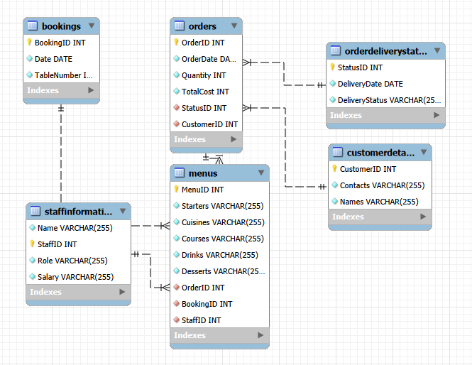
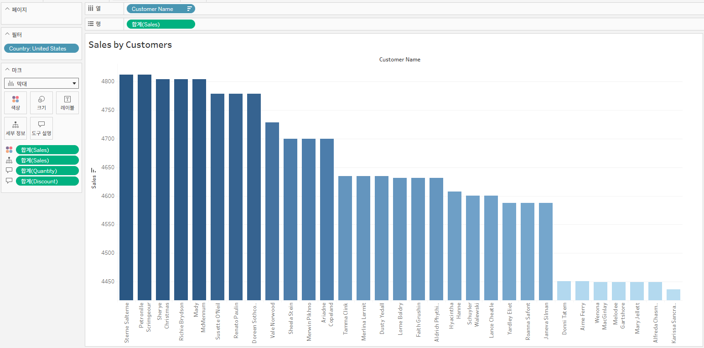
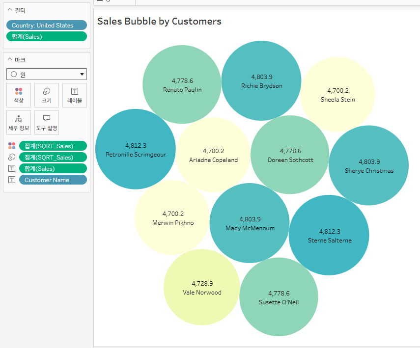
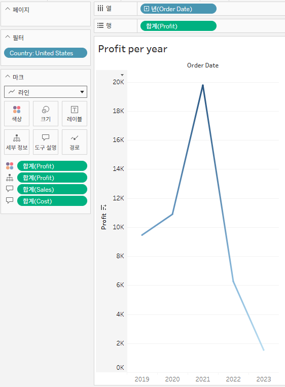
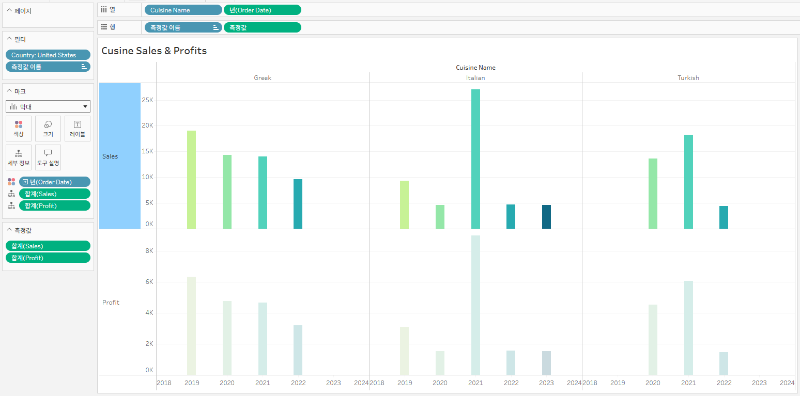
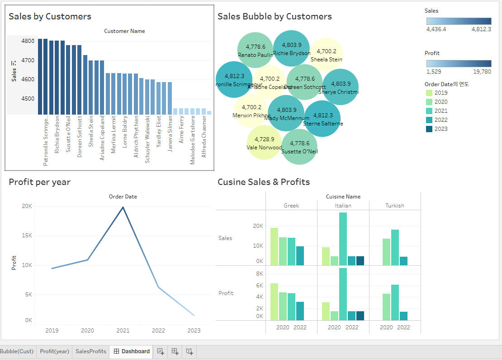

# 04.Meta_Database_Engineer_Capstone
- June 2026, by Songhyun Cho

## Instructions by Meta

- As part of the final assessment criteria, you were provided with some sample booking data that you were asked to save to a database. To create a successful Booking implementation, you were asked to complete the following actions:
  - Create a database that holds the data.
  - Connect to the database using a Python client.
  - Create a procedure using Python to react to changes in the data.
  - Connect to the database using Tableau.
  - Generate data reports using Tableau.
 
## <span style="color:skyblue;">My Project</span>
### LittleLemon Project in MySQL_Workbench
- ER Diagram with Reverse Engineering 
 

- Create Tables
```sql
-- Configuration 
SET @OLD_UNIQUE_CHECKS=@@UNIQUE_CHECKS, UNIQUE_CHECKS=0;
SET @OLD_FOREIGN_KEY_CHECKS=@@FOREIGN_KEY_CHECKS, FOREIGN_KEY_CHECKS=0;
SET @OLD_SQL_MODE=@@SQL_MODE, SQL_MODE='ONLY_FULL_GROUP_BY,STRICT_TRANS_TABLES,NO_ZERO_IN_DATE,NO_ZERO_DATE,ERROR_FOR_DIVISION_BY_ZERO,NO_ENGINE_SUBSTITUTION';

-- Create Database 
CREATE DATABASE IF NOT EXISTS `LittleLemon` ;
USE `LittleLemon` ;

-------------------
-- Create Tables
-------------------

-- Create Table `Bookings`
DROP TABLE IF EXISTS `Bookings`;
CREATE TABLE IF NOT EXISTS `Bookings` (
  `BookingID` INT NOT NULL,
  `Date` DATE NOT NULL,
  `TableNumber` INT NOT NULL,
  PRIMARY KEY (`BookingID`))
ENGINE = InnoDB;

-- Create Table `CustomerDetails`
DROP TABLE IF EXISTS `CustomerDetails`;
CREATE TABLE IF NOT EXISTS `CustomerDetails` (
  `CustomerID` INT NOT NULL,
  `Contacts` VARCHAR(255) NOT NULL,
  `Names` VARCHAR(255) NOT NULL,
  PRIMARY KEY (`CustomerID`))
ENGINE = InnoDB;

-- Create Table `OrderDeliveryStatus`
DROP TABLE IF EXISTS `OrderDeliveryStatus`;
CREATE TABLE IF NOT EXISTS `OrderDeliveryStatus` (
  `StatusID` INT NOT NULL,
  `DeliveryDate` DATE NOT NULL,
  `DeliveryStatus` VARCHAR(255) NOT NULL,
  PRIMARY KEY (`StatusID`))
ENGINE = InnoDB;

-- Create Table `Orders`
DROP TABLE IF EXISTS `Orders`;
CREATE TABLE IF NOT EXISTS `Orders` (
  `OrderID` INT NOT NULL,
  `OrderDate` DATE NOT NULL,
  `Quantity` INT NOT NULL,
  `TotalCost` INT NOT NULL,
  `StatusID` INT NOT NULL,
  `CustomerID` INT NOT NULL,
  PRIMARY KEY (`OrderID`),
  INDEX `Customer_fk_idx` (`CustomerID` ASC) VISIBLE,
  INDEX `Order_fk_idx` (`StatusID` ASC) VISIBLE,

  CONSTRAINT `Customer_fk`
    FOREIGN KEY (`CustomerID`)
    REFERENCES `CustomerDetails` (`CustomerID`)
    ON DELETE NO ACTION
    ON UPDATE NO ACTION,
  CONSTRAINT `Order_fk`
    FOREIGN KEY (`StatusID`)
    REFERENCES `OrderDeliveryStatus` (`StatusID`)
    ON DELETE CASCADE
    ON UPDATE CASCADE)
ENGINE = InnoDB;

-- Create Table `StaffInformation`
DROP TABLE IF EXISTS `StaffInformation`;
CREATE TABLE IF NOT EXISTS `StaffInformation` (
  `Name` VARCHAR(255) NOT NULL,
  `StaffID` INT NOT NULL,
  `Role` VARCHAR(255) NOT NULL,
  `Salary` VARCHAR(255) NOT NULL,
  PRIMARY KEY (`StaffID`))
ENGINE = InnoDB;

# -- Create Table `Menus`
DROP TABLE IF EXISTS `Menus`;
CREATE TABLE IF NOT EXISTS `Menus` (
  `MenuID` INT NOT NULL,
  `Starters` VARCHAR(255) NOT NULL,
  `Cuisines` VARCHAR(255) NOT NULL,
  `Courses` VARCHAR(255) NOT NULL,
  `Drinks` VARCHAR(255) NOT NULL,
  `Desserts` VARCHAR(255) NOT NULL,
  `OrderID` INT NOT NULL,
  `BookingID` INT NOT NULL,
  `StaffID` INT NOT NULL,
  PRIMARY KEY (`MenuID`),
  INDEX `Menu_fk_idx` (`OrderID` ASC) VISIBLE,
  INDEX `Bookings_fk_idx` (`BookingID` ASC) VISIBLE,
  INDEX `Staff_fk_idx` (`StaffID` ASC) VISIBLE,

  CONSTRAINT `Menu_fk`
    FOREIGN KEY (`OrderID`)
    REFERENCES `Orders` (`OrderID`)
    ON DELETE CASCADE
    ON UPDATE CASCADE,
  CONSTRAINT `Bookings_fk`
    FOREIGN KEY (`BookingID`)
    REFERENCES `Bookings` (`BookingID`)
    ON DELETE CASCADE
    ON UPDATE CASCADE,
  CONSTRAINT `Staff_fk`
    FOREIGN KEY (`StaffID`)
    REFERENCES `StaffInformation` (`StaffID`)
    ON DELETE CASCADE
    ON UPDATE CASCADE)
ENGINE = InnoDB;

-- Configuration Restoration 
SET SQL_MODE=@OLD_SQL_MODE;
SET FOREIGN_KEY_CHECKS=@OLD_FOREIGN_KEY_CHECKS;
SET UNIQUE_CHECKS=@OLD_UNIQUE_CHECKS;

-- END
```

- Insert Data into the Tables
```sql
INSERT INTO `CustomerDetails` (`CustomerID`, `Names`, `Contacts`)
VALUES
  (1, 'John Doe', 'john.doe@example.com'),
  (2, 'Jane Doe', 'jane.doe@example.com'),
  (3, 'Alice', 'alice@example.com'),
  (4, 'Bob', 'bob@example.com'),
  (5, 'Charlie', 'charlie@example.com'),
  (6, 'David', 'david@example.com'),
  (7, 'Emily', 'emily@example.com'),
  (8, 'Frank', 'frank@example.com'),
  (9, 'Grace', 'grace@example.com'),
  (10, 'Hannah', 'hannah@example.com');
  
INSERT INTO `StaffInformation` (`StaffID`, `Name`, `Role`, `Salary`)
VALUES
  (1,'Sarah', 'Manager', 55000),
  (2,'Tom', 'Waiter', 30000),
  (3,'Linda', 'Chef', 40000),
  (4,'Robert', 'Cashier', 31000),
  (5,'Daniel', 'Waiter', 32000),
  (6,'Susan', 'Hostess', 28000),
  (7,'Chris', 'Manager', 60000),
  (8,'Jessica', 'Chef', 38000),
  (9,'Brian', 'Waiter', 29000),
  (10,'Kim', 'Hostess', 27000);
 
INSERT INTO `Bookings` (`BookingID`, `Date`, `TableNumber`)
VALUES
  (1, '2023-09-01 12:00:00', 10),
  (2, '2023-09-01 12:30:00', 12),
  (3, '2023-09-02 13:00:00', 14),
  (4, '2023-09-02 14:00:00', 16),
  (5, '2023-09-03 15:00:00', 18),
  (6, '2023-09-03 16:00:00', 20),
  (7, '2023-09-04 17:00:00', 22),
  (8, '2023-09-04 18:00:00', 24),
  (9, '2023-09-05 19:00:00', 26),
  (10, '2023-09-05 20:00:00', 28); 

INSERT INTO `OrderDeliveryStatus` (`StatusID`, `DeliveryDate`, `DeliveryStatus`)
VALUES
  (1, '2023-09-01 12:15:00', 'Delivered'),
  (2, '2023-09-01 12:45:00', 'Preparing'),
  (3, '2023-09-02 13:15:00', 'Preparing'),
  (4, '2023-09-02 14:15:00', 'Out for delivery'),
  (5, '2023-09-03 15:15:00', 'Out for delivery'),
  (6, '2023-09-03 16:15:00', 'Delivered'),
  (7, '2023-09-04 17:15:00', 'Preparing'),
  (8, '2023-09-04 18:15:00', 'Delivered'),
  (9, '2023-09-05 19:15:00', 'Delivered'),
  (10, '2023-09-05 20:15:00', 'Delivered');

INSERT INTO `Orders` (OrderID, OrderDate, Quantity, TotalCost, StatusID, CustomerID)
VALUES
  (1, '2023-09-01 12:00:00', 3, 499, 1, 5),
  (2, '2023-09-01 12:30:00', 2, 295, 2, 8),
  (3, '2023-09-02 13:00:00', 4, 599, 3, 4),
  (4, '2023-09-02 14:00:00', 1, 199, 4, 7),
  (5, '2023-09-03 15:00:00', 5, 795, 5, 1),
  (6, '2023-09-03 16:00:00', 2, 295, 6, 9),
  (7, '2023-09-04 17:00:00', 3, 499, 7, 2),
  (8, '2023-09-04 18:00:00', 4, 599, 8, 6),
  (9, '2023-09-05 20:00:00', 1, 199, 9, 3),
  (10, '2023-09-05 20:00:00', 5, 795, 10, 10); 
  
INSERT INTO `Menus` (MenuID, Starters, Cuisines, Courses, Drinks, Desserts, OrderID, BookingID, StaffID)
VALUES
  (1, 'Garlic Butter Shrimp', 'Italian', 'Appetizer', 'White Wine', 'Tiramisu', 1, 1, 1),
  (2, 'Spring Rolls', 'Chinese', 'Appetizer', 'Green Tea', 'Fruit Tart', 2, 2, 2),
  (3, 'Caprese Salad', 'Italian', 'Salad', 'Iced Tea', 'Cheesecake', 3, 3, 3),
  (4, 'Chicken Wings', 'American', 'Appetizer', 'Soda', 'Chocolate Cake', 4, 4, 4),
  (5, 'Tomato Soup', 'French', 'Soup', 'Red Wine', 'Creme Brulee', 5, 5, 5),
  (6, 'Sushi Rolls', 'Japanese', 'Appetizer', 'Sake', 'Mochi Ice Cream', 6, 6, 6),
  (7, 'Hummus with Pita', 'Lebanese', 'Appetizer', 'Mint Tea', 'Baklava', 7, 7, 7),
  (8, 'Tandoori Chicken', 'Indian', 'Main Course', 'Lassi', 'Gulab Jamun', 8, 8, 8),
  (9, 'Greek Salad', 'Greek', 'Salad', 'Ouzo', 'Baklava', 9, 9, 9),
  (10, 'Steak au Poivre', 'French', 'Main Course', 'Red Wine', 'Creme Brulee', 10, 10, 10);
```
- Procedures
```sql
-- (1) GetMaxQuantity
DROP PROCEDURE IF EXISTS `GetMaxQuantity`; 
CREATE PROCEDURE `GetMaxQuantity`()
SELECT max(quantity) AS `Max_Quantity` FROM Orders ; 
-- Call this Procedure
Call `littlelemon`.`GetMaxQuantity`();

----------------
-- (2) ManageBooking
DROP PROCEDURE IF EXISTS `ManageBooking`;
DELIMITER //
CREATE PROCEDURE `ManageBooking`(
    IN booking_id INT,
    IN booking_date DATE,
    IN table_number INT)

BEGIN
  DECLARE booking_count INT ;
  DECLARE EXIT HANDLER FOR SQLEXCEPTION
  BEGIN
    -- rollback the transaction when error occurs
    ROLLBACK;
    SELECT 'Error occurred! Transaction rolled back.' AS Status ;
  END;

  START TRANSACTION;

  -- 1. Check table already booked
  SELECT COUNT(*)
  INTO booking_count
  FROM Bookings
  WHERE `Date` = booking_date
  AND `TableNumber` = table_number
  AND `BookingID` <> booking_id;

  IF booking_count > 0 THEN
    ROLLBACK;
    SELECT CONCAT('Table ', table_number, 'is already booked for this date') AS Status;
  ELSE
    UPDATE Bookings
    SET `Date` = booking_date,
        `TableNumber` = table_number,
        `BookingID` = booking_id
    WHERE `BookingID` = booking_id;

    COMMIT;
    SELECT 'Booking Succesfully updated!' AS Status;
  END IF;
END;
//
DELIMITER ;
-- Call this Procedure
Call `littlelemon`.`ManageBooking`(11, '2023-09-02 21:00:00', 10);

----------------
-- (3) UpdateBooking
DROP PROCEDURE IF EXISTS `UpdateBooking`;
DELIMITER //
CREATE PROCEDURE `UpdateBooking`(
    IN booking_id INT,
    IN booking_date DATE)

BEGIN
UPDATE Bookings SET `Date` = booking_date WHERE `BookingID` = booking_id;
SELECT CONCAT("Booking", booking_id, "updated") AS `Update_Confirmed`;
END;
//
DELIMITER ;
-- Call this Procedure
Call `littlelemon`.`UpdateBooking`(10, '2023-09-06 20:00:00');

----------------
-- (4) AddBooking
DROP PROCEDURE IF EXISTS `AddBooking`;
DELIMITER //
CREATE PROCEDURE `AddBooking`(
    IN new_booking_id INT,
    IN new_booking_date DATE,
    IN new_table_number INT)

BEGIN
    -- Insert the new booking record
    INSERT INTO `Bookings`(
        `BookingID`,
        `Date`,
        `TableNumber`)
    VALUES(
        new_booking_id,
        new_booking_date,
        new_table_number
    );

    SELECT 'New booking added' AS `Add_Confirmed`;
END;
//
DELIMITER ;
-- Call this Procedure
Call `littlelemon`.`AddBooking`(11, '2023-09-06 21:00:00', 30);

----------------
-- (5) CancelBooking
DROP PROCEDURE IF EXISTS `CancelBooking`;
DELIMITER //
CREATE PROCEDURE `CancelBooking`(
    IN booking_id_to_cancel INT)

BEGIN
    -- Delete the booking record
    DELETE FROM `Bookings`
    WHERE `BookingID` = booking_id_to_cancel;

    SELECT CONCAT('Booking ', booking_id_to_cancel, ' cancelled') AS `Cancel_Confirmed`;
END;
//
DELIMITER ;
-- Call this Procedure
Call `littlelemon`.`CancelBooking`(11);
```
### Visualization with Tableau
- Sales by Customers


- Sales Bubble Chart by Customers


- Profit per year


- Cuisine Sales & Profits


- Overall Dashboard

